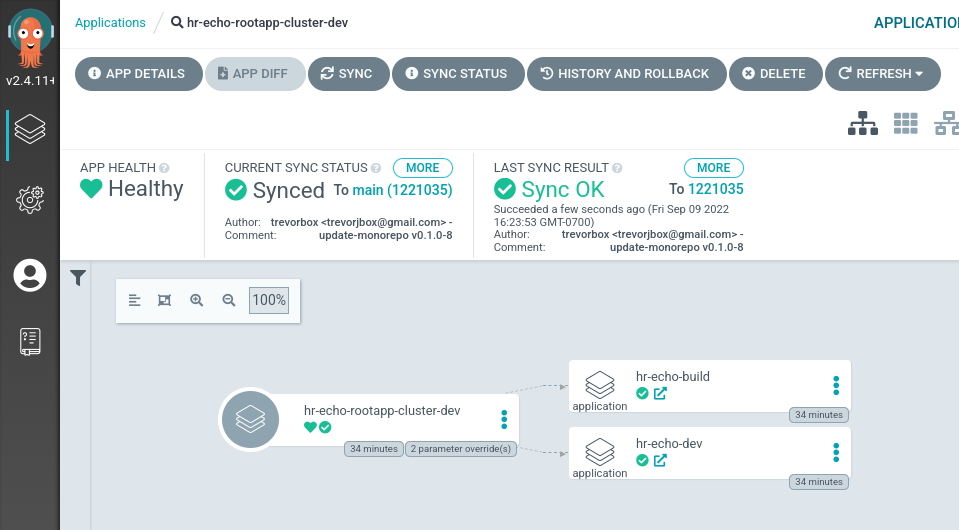
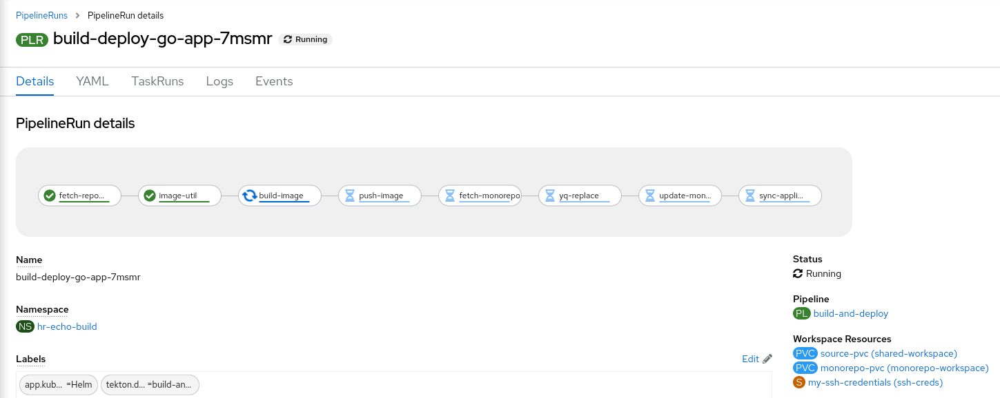

# gitops-example-monorepo-go

An example infrastructure as code (IAC) monorepo to house gitops, pipeline, and deployment source code used to build and deploy an [example go application](https://github.com/trevorbox/s2i/tree/master/go).

## setup

### deploy operators

```sh
helm upgrade -i openshift-pipelines-operator setup/helm/openshift-pipelines-operator/ -n openshift-operators
```

```sh
helm upgrade -i openshift-gitops-operator setup/helm/openshift-gitops-operator/ -n openshift-operators
# delete default controller in openshift-gitops namespace if not needed
oc delete gitopsservice cluster -n openshift-gitops
```

### create namespaces and setup vars

```sh
export argo_namespace=cicd
export envs=( dev build qa perf prod )
export context=echo
export org=hr

for i in "${envs[@]}"; do ns=${org}-${context}-${i} && oc new-project ${ns} && oc label namespace ${ns} argocd.argoproj.io/managed-by=${argo_namespace}; done
```

> Note: there should be a Group created that your User belongs to and defined in the ArgoCD CR's spec.rbac section to allow your user admin access

example ArgoCD CR spec.rbac snippet:

```yaml
  rbac:
    defaultPolicy: ''
    policy: |
      g, cluster-admins, role:admin
    scopes: '[groups]'
```

### deploy argocd

```sh
helm upgrade -i cicd setup/helm/argocd/ -n ${argo_namespace} --create-namespace
```

## deploy applicationset

Deploy either the cluster dev, stage, or prod applicationset. This demonstrates deploying the same applicationset for different clusters (although we are demonstrating with only one) with different namespaces (environments) for each context.

```sh
# dev cluster
helm upgrade -i applicationset-hr-echo argocd/helm/applicationset/ -n ${argo_namespace} \
  -f argocd/helm/applicationset/values-cluster-dev.yaml
```

OR

```sh
# stage cluster
helm upgrade -i applicationset-hr-echo argocd/helm/applicationset/ -n ${argo_namespace} \
  -f argocd/helm/applicationset/values-cluster-stage.yaml
```

OR

```sh
# prod cluster
helm upgrade -i applicationset-hr-echo argocd/helm/applicationset/ -n ${argo_namespace} \
  -f argocd/helm/applicationset/values-cluster-prod.yaml
```

In a real-world scenario, development on the monorepo would require branching from the `main` branch but also updating an ApplicationSet cluster/namespace config file in the `main` branch to point to a feature branch.

By using the [Git Generator](https://argocd-applicationset.readthedocs.io/en/stable/Generators-Git/) type to generate Applications from the ApplicationSet, we can simply modify configuration files in our monorepo to change the parameters passed to Applications.

The folder structure for these parameters files corresponds to a cluster with one or more namespaces.

```sh
[tbox@fedora gitops-example-monorepo-go]$ tree argocd/clusters/
argocd/clusters/
├── dev
│   └── namespaces
│       ├── build.yaml
│       └── dev.yaml
├── prod
│   └── namespaces
│       └── prod.yaml
└── stage
    └── namespaces
        ├── perf.yaml
        └── qa.yaml
```

We can then modify the Application parameters to sync with the desired branch by changing the yaml file in the `main` branch.

```sh
[tbox@fedora gitops-example-monorepo-go]$ cat argocd/clusters/dev/namespaces/dev.yaml 
env: dev
targetRevision: 'feature/feature1' # change this back to main when the feature branch is merged back to main on the main branch
addFinalizer: true
```

After the push, you must wait for the ApplicationSet to reconcile.

## (optional) deploy rootapp

The rootapp can be used instead of the ApplicationSet if desired. A benfit with this approach is quickly forcing a sync from the rootapp instead of having to wait for the ApplicationSet to reconcile.



```sh
# dev cluster rootapp
helm upgrade -i rootapp argocd/helm/rootapp/ -n ${argo_namespace} \
  --set org=${org} \
  --set context=${context} \
  -f argocd/helm/rootapp/values-cluster-dev.yaml
# stage cluster rootapp
helm upgrade -i rootapp argocd/helm/rootapp/ -n ${argo_namespace} \
  --set org=${org} \
  --set context=${context} \
  -f argocd/helm/rootapp/values-cluster-stage.yaml
# prod cluster rootapp
helm upgrade -i rootapp argocd/helm/rootapp/ -n ${argo_namespace} \
  --set org=${org} \
  --set context=${context} \
  -f argocd/helm/rootapp/values-cluster-prod.yaml
```

## deploy build pipeline



```sh
export build_namespace=${org}-${context}-build
```

```sh
podman login quay.io
helm upgrade -i build-and-deploy-go-app-pipeline pipelines/helm/build -n ${build_namespace} \
  --set-file quay.dockerconfigjson=${XDG_RUNTIME_DIR}/containers/auth.json \
  --set-file github.ssh.id_rsa=${HOME}/.ssh/tkn/id_ed25519 \
  --set-file github.ssh.known_hosts=${HOME}/.ssh/known_hosts \
  --set argocd.server=argocd-server.${argo_namespace}.svc.cluster.local \
  --set argocd.username=admin \
  --set argocd.password=$(oc get secret argocd-cluster -n ${argo_namespace} -o jsonpath={.data.admin\\.password} | base64 -d) \
  --create-namespace
```

## build image-util

We need to create our own utilitly image for the pipeline to inspect the next semver from remote registries, use the yq tool to update yaml files in a monorepo and setup variables like base/builder image digest values.

> Note: make the image publicly accessible in quay.io after it is pushed (if needed)

```sh
helm upgrade -i build-image-util image-util/helm/build -n ${build_namespace}
```

## pipelinerun on image change

We can use a BuildConfig to run a custom script baked into a custom image to create PiplelineRuns whenever a builder or base ImageStreamTag (IST) imports new latest images (scheduled every 15 minutes by default).

See [Image Change Triggers for Tekton](https://labs.consol.de/development/kubernetes/openshift/2022/03/14/image-change-triggers-for-tekton.html) for more details on this concept.


### build pipelinerun on image change

> Note: make the image publicly accessible in quay.io after it is pushed (if needed)

```sh
helm upgrade -i build-pipelinerun-imagechange-go-app pipelinerun-imagechange-go-app/helm/build -n ${build_namespace}
```

### deploy pipelinerun on image change

```sh
helm upgrade -i deploy-pipelinerun-imagechange-go-app pipelinerun-imagechange-go-app/helm/deploy -n ${build_namespace}
```

## manually create a pipelinerun

```sh
oc apply -f pipelines/pipelinerun-build-deploy-go-app.yaml -n ${build_namespace}
```

## cleanup

```sh
helm delete build-image-util -n ${build_namespace}
helm delete build-pipelinerun-imagechange-go-app -n ${build_namespace}
helm delete deploy-pipelinerun-imagechange-go-app -n ${build_namespace}
helm delete build-and-deploy-go-app-pipeline -n ${build_namespace}
oc delete -f pipelines/pipelinerun-build-deploy-go-app.yaml -n ${build_namespace}

helm delete rootapp -n ${argo_namespace}
for i in "${envs[@]}"; do ns=${org}-${context}-${i} && oc delete project ${ns}; done
```

## argocd rollouts

### argocd rollouts install

To test out cluster-scoped ArgoCD Rollouts use the following to install ...

```sh
kubectl create namespace argo-rollouts
kubectl apply -n argo-rollouts -f https://github.com/argoproj/argo-rollouts/releases/latest/download/install.yaml
```

### argocd rollouts cli plugin install

See <https://argo-rollouts.readthedocs.io/en/stable/installation/#kubectl-plugin-installation>

### argocd rollouts blue/green test

The deployment chart for the application has an optional flag to use ArgoCD Rollouts instead of Deployments. You will need to commit a change to the desired values file in this monorepo's main branch.

for example...

```sh
[tbox@fedora gitops-example-monorepo-go]$ cat deploy/helm/app/values-dev.yaml 
image:
  repository: quay.io/trevorbox/go-app
  # Overrides the image tag whose default is the chart appVersion.
  tag: "v0.1.0-15"
useArgoRollout: true
```

The Rollout uses a blue/green strategy and runs a prePromotionAnalysis k8s Job before before allowing the switch-over, if successful.

example successful rollout after pipeline rebuild...

```sh
[tbox@fedora gitops-example-monorepo-go]$ kubectl argo rollouts get rollouts hr-echo-dev-app -n hr-echo-dev
Name:            hr-echo-dev-app
Namespace:       hr-echo-dev
Status:          ✔ Healthy
Strategy:        BlueGreen
Images:          quay.io/trevorbox/go-app:v0.1.0-16 (stable, active)
Replicas:
  Desired:       1
  Current:       1
  Updated:       1
  Ready:         1
  Available:     1

NAME                                                          KIND         STATUS        AGE  INFO
⟳ hr-echo-dev-app                                             Rollout      ✔ Healthy     20m  
├──# revision:2                                                                               
│  ├──⧉ hr-echo-dev-app-744cf678c8                            ReplicaSet   ✔ Healthy     12m  stable,active
│  │  └──□ hr-echo-dev-app-744cf678c8-6rz5w                   Pod          ✔ Running     12m  ready:1/1
│  └──α hr-echo-dev-app-744cf678c8-2-pre                      AnalysisRun  ✔ Successful  12m  ✔ 1
│     └──⊞ 2a985827-17b3-4c11-a828-791c99fa67cf.smoke-test.1  Job          ✔ Successful  12m  
└──# revision:1                                                                               
   └──⧉ hr-echo-dev-app-545566945c                            ReplicaSet   • ScaledDown  20m 
```

example failure (AnalysisRun Job failure by changing to the [always-fail](./deploy/helm/app/templates/rollout/analysistemplate-always-fail.yaml) AnalysisTemplate)...

```sh
[tbox@fedora gitops-example-monorepo-go]$ kubectl argo rollouts get rollouts hr-echo-dev-app -n hr-echo-dev
Name:            hr-echo-dev-app
Namespace:       hr-echo-dev
Status:          ✖ Degraded
Message:         RolloutAborted: Rollout aborted update to revision 3: Metric "always-fail" assessed Failed due to failed (1) > failureLimit (0)
Strategy:        BlueGreen
Images:          quay.io/trevorbox/go-app:v0.1.0-16 (stable, active)
Replicas:
  Desired:       1
  Current:       1
  Updated:       0
  Ready:         1
  Available:     1

NAME                                                           KIND         STATUS        AGE  INFO
⟳ hr-echo-dev-app                                              Rollout      ✖ Degraded    47m  
├──# revision:3                                                                                
│  ├──⧉ hr-echo-dev-app-7fdc57b8cf                             ReplicaSet   • ScaledDown  20m  preview,delay:passed
│  └──α hr-echo-dev-app-7fdc57b8cf-3-pre                       AnalysisRun  ✖ Failed      19m  ✖ 1
│     └──⊞ 9f20f627-4970-4567-9f7d-5a99df04f009.always-fail.1  Job          ✖ Failed      19m  
├──# revision:2                                                                                
│  ├──⧉ hr-echo-dev-app-744cf678c8                             ReplicaSet   ✔ Healthy     39m  stable,active
│  │  └──□ hr-echo-dev-app-744cf678c8-6rz5w                    Pod          ✔ Running     39m  ready:1/1
│  └──α hr-echo-dev-app-744cf678c8-2-pre                       AnalysisRun  ✔ Successful  39m  ✔ 1
│     └──⊞ 2a985827-17b3-4c11-a828-791c99fa67cf.smoke-test.1   Job          ✔ Successful  39m  
└──# revision:1                                                                                
   └──⧉ hr-echo-dev-app-545566945c                             ReplicaSet   • ScaledDown  47m  
```

The sync step in the pipeline also fails due to degraded Rollout...


